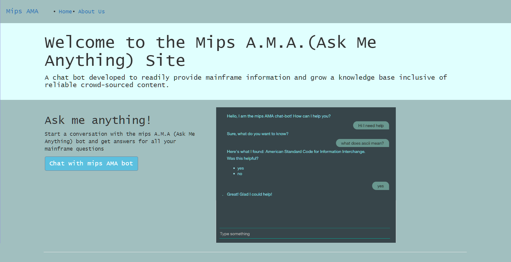
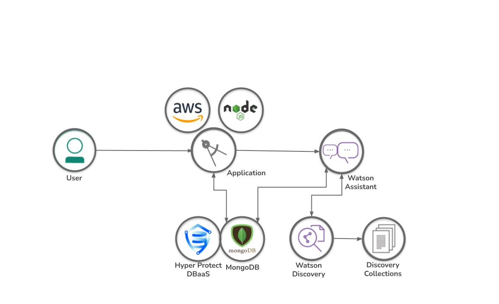

# Documentation Folder
| Document | Description |
|---|---|
| [Statement of Work](#Statement-of-work) | Short description of the project, description of Current state, value, business requirements |
| Architecture | High-level design.  Components and where they would exist (e.g. web server, database server, application server, z/OS |
| Detailed Design | Identify modules making up each component.  data flows between modules.  Also ERDs and other documentation depending upon technologies used |
| Installation Guide| How to install and configure the project |
| User Guide | Any user interface instructions |





## Statement of Work
<p>The goal of the MIPS Bot AMA Project is to establish a chatbot that can assist developers and new programmers with learning about the IBM Mainframe. The bot, powered by IBM Watson Assistant, will use a combination of machine learning and crowdsourcing to develop nuanced, and easily readable answers to general system queries, and specific api questions.</p>
<p> In the applications current version, it is delivered on a simple user interface with a potential for additional features and front-end components. The bot can successfully respond to users questions given the recognition of a context variable referencing an entry in it's collection of responses, it is also enabled to utilize Watson Discovery to query any other documentation in it's knowledge base given a compatible versoining on Watson Discovery is provisioned to the bot. The chat bot also logs conversation, including in this log what was recognized as the intent, entity or context variable in addition to the user input and response from watson. The dialogue is enabled to encourage user feedback as well as user suggestion to enable crowd sourcing, these are also logged into separate collections for organization.</p> 


## Architecture
<p> The Mips A.M.A. bot is built initially using Watson Assistant on the IBM Cloud to define an intial dialogue, intents, entities, and entities. Additionally, the IBM Cloud is utilized to provision the bots database on Hyper Protect for MongoDBaaS, Watson Discovery, and at the current point, with intentions to move for efficiency, any webhooks used by the bot are completed through web actions in IBM's cloud functions. At that point, the bot can be accessed via an API Key and further developments move primarily to a NodeJS application, dockerized, and hosted on AWS using EC2 and Elastic Beanstalk. </p>




## Detailed Design

1. Watson Assistant 
    - Used to outline conversation. Defines dialogue flow with nodes, recognition of intents and entities, definition and recognition of context variables.
1. Watson Discovery and Discoery Collections
    - Used as an expansion of the bots knowledge base, enables the bot to query large resources, such as entire RedBooks, stored within the Discoery collection. Must be provisioned to ensure text values are recognized correctly (i.e. header, paragraph, subtitle) and on a versioned tiered for compatibility with Watson Assitant.
1. Hyper Protect DBaaS for MongoDB
    - MongoDB is used across the board for the application with collections for the content such as the z/OS dictionary, conversation logs, feedback logs, and crowd suggestion logs.
1. NodeJS
    - The application was developed in a NodeJS environment, enabling further development remaining on the IBM Cloud would have constrained. This is where the application is made able to connect the database to store conversation, feedback and suggestion logs by scripting schemas and logging the aforementioned content to the collection as it happens. 
1. AWS
    - The application is hosted on AWS utilizing EC2 and Elastic Beanstalks docker build. The application must be Dockerized to utilize this variation of hosting. 


## Installation

1. Sign up for an [IBM Cloud account](https://cloud.ibm.com/registration).
1. Download the [assistant JSon](https://github.com/openmainframeproject-internship/CS-21-316-MIPS-Bot-AMA-Ask-Me-Anything/blob/master/src/mips-bot/training/scratch-assistant-skill.json) for the dialogue and the [MongoDB collection JSon](https://github.com/openmainframeproject-internship/CS-21-316-MIPS-Bot-AMA-Ask-Me-Anything/blob/master/src/Resources/zOS.json) for basic querying and the [webhook javascript file](https://github.com/openmainframeproject-internship/CS-21-316-MIPS-Bot-AMA-Ask-Me-Anything/blob/master/src/Resources/routeFind.js) for your cloud functions.  
1. Create an instance of the Watson Assistant service and get your credentials:
   - Go to the [Watson Assistant][service_url] page in the IBM Cloud Catalog.
   - Log in to your IBM Cloud account.
   - Click **Create**.
   - Import the assistant JSon downloaded in the step above. 
   - Click **Show** to view the service credentials.
   - Note the `apikey`, `url`, and `assitant ID` to add as environment variables.
1. Create an instance of the Hyper Protect DBaaS for MongoDB service:
   - Go to the [Hyper Protect DBaaS][mongo_url] page in the IBM Cloud Catalog.
   - Click **Create**.
   - Download MongoDB Compass to view and edit your database collections.
   - Follow the login instructions from the IBM Cloud to connect on Compass.
   - Import the collections JSon to your database from the step above. 
   - Note the `cluster url` to add as an environment variable.
1. Create a web action in IBM cloud functions:
   - Go to the [Cloud Functions][cloud_func_url] page in the IBM Cloud Catalog.
   - Navigate to web actions and select **Create**
   - Select NodeJS and copy the webhook javascript file saved earlier and edit it to add the cluster url from your MongoDB instance.
   - Note the url. Return to Watson Assistant and in the dialogue settings, navigate to webhooks and add this as the url. 
1. Run the bot locally:
   - Fork or clone the mips-bot directory.
   - create a .env file and define `WATSON_API_KEY`, `WATSON_URL`, `WATSON_ID` and `MONGO_URL` from the values you should have noted in the previous steps. 
   - Open the terminal and install the dependencies:
      
      ```
      npm install
      ```
      And run the application
      
      ```
      npm start
      ```
      
   - Navigate to `localhost:3000` to view the application.


[service_url]: https://www.ibm.com/cloud/watson-assistant/
[mongo_url]: https://www.ibm.com/cloud/hyper-protect-dbaas/
[cloud_func_url]: https://cloud.ibm.com/functions/
